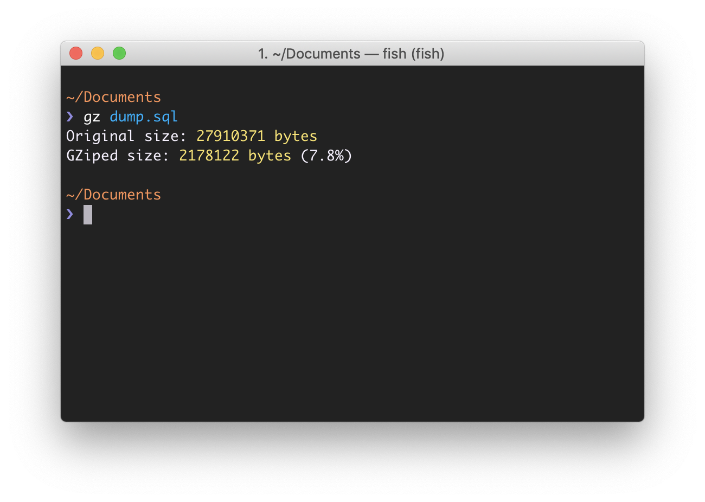

# GZ
Tiny script with which you can find out the file size after gzip compression.

<p align="center">

</p>

## Usage

Enter the command `gz` and the name of the file you want to check into the terminal

```sh
$ gz file.png
```

